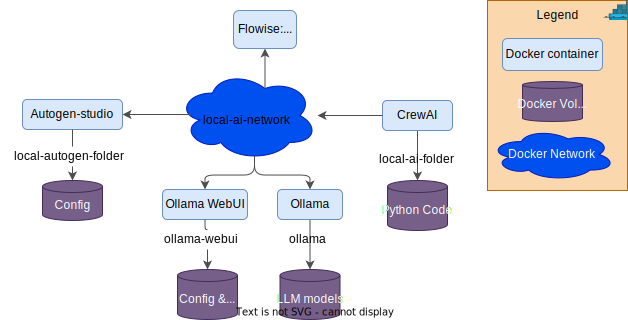

# docker-local-ai

With this project you can install a number of different AI tools locally as Docker containers.

The goal is to make it easy to install & run these different tools using the local Ollama server where you can run the LLM models locally, but the agent frameworks & most other tools can also be used with cloud LLM's if you want to.

Using Docker to deploy the applications isolates your host OS from installing a lot of different things & makes it safer to test new tools.

Where applicable configuration has also been added to make use of your local NVidia GPU to improve inference speed.

You can either install each application by itself by using the **install**-file in each folder or use the root **install**-script to get a question for which you want to use.

There is also a similar **cleanup-all** script under each folder & a central under scripts to clean all Docker containers, created Docker volumes & Docker networks.

## Overview

### Logical view

This is a logical overview of the components:

### Deployment overview

This is a overview of what will be deployed:

## Installation

You have the option to install a number of AI related docker containers and code volume by running the **install.bat** script

You will get a question for each tool if you want to install it or not.

If you just want to install one tool without all questions just go into the relevant folder & run install.
A lot of the tools depend on Ollama being installed first though (if you want to run the LLM locally)

These are the docker containers that can be installed

- Run LLM's locally on your own hardware
  - [Ollama](ollama/ReadMe.md) - Local AI model engine to run LLM's locally
- LLM chat Web interfaces
  - [Ollama Open WebUI](ollama/ReadMe.md) - A Web UI for Ollama or other LLM's
  - [AnythingLLM](AnythingLLM/ReadMe.md)- AnythingLLM is an open-source platform that lets you communicate with various LLMs through a unified interface.
- Visual Agent tools, where you draw your AI flows with no code (unless using tools)
  - [Flowise](flowise/ReadMe.md)- Visual LLM UI
  - [N8N](n8n/ReadMe.md)- n8n is a workflow automation tool.
- Code generator
  - [Bolt.diy](bolt.diy/ReadMe.md)- Bolt.diy is an open-source platform for building Web UI's.
- Agent frameworks
  - [Autogen-studio](autogen-studio/ReadMe.md) - AI Agent framework
  - **CrewAI**, **SwarmAI** & **OpenAI API code**, see under dev container folder below
- Image generation using prompts
  - [ComfyUI](comfy_ui/ReadMe.md) - Text to image AI tool

### Dev containers

The following Agent framework tools are best run using the supplied dev containers

- [Pure code](ollama/demo_code/ReadMe.md) - Local AI model engine & Web UI for Ollama
- [CrewAI](crewai/ReadMe.md) - AI Agent framework
- [OpenAI Swarm](swarm/ReadMe.md) - AI Agent framework by OpenAI (Beta)

## Webcasts

In this YouTube playlist you can see some webcasts related to this GitHub repository:
https://www.youtube.com/playlist?list=PLoZRZ2zrcw_-Oi3Sp3IeW2zAWAMEbKKOd

## More info about the different apps

On the page linked [here](docs/ai-apps.md) you can find some more info for each of the apps that can be installed using this repository

## Pre-reqs

- **Docker** must have been installed first
- **npm** needs to be installed for some tools to be able to build the fetched code before creating a Docker image

## Port reservations

Information about what ports that are used by each container can be found [here](docs/ports.md)

## Synology NAS

The scripts in the synology-nas folder can be used to install and configure the AI tools on a Synology NAS docker instance.

More info can be found [here](synology-nas/readme.md)

## VS Code AI plugins

You can run **vscode-plugins.bat** if you want to install a number of nice AI related extensions for Visual Studio Code.

## Project files

Information about the file structure of the project can be found [here](docs/files.md)
